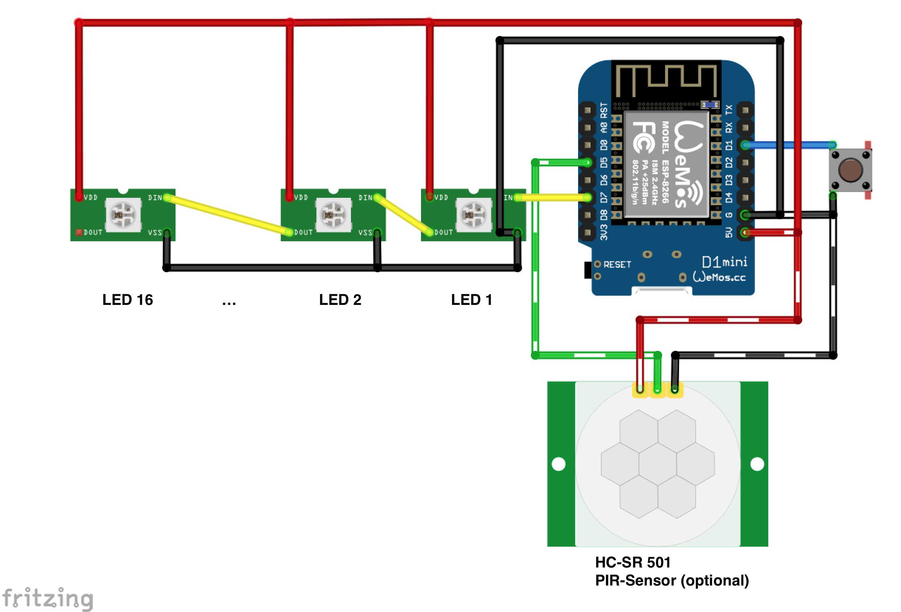
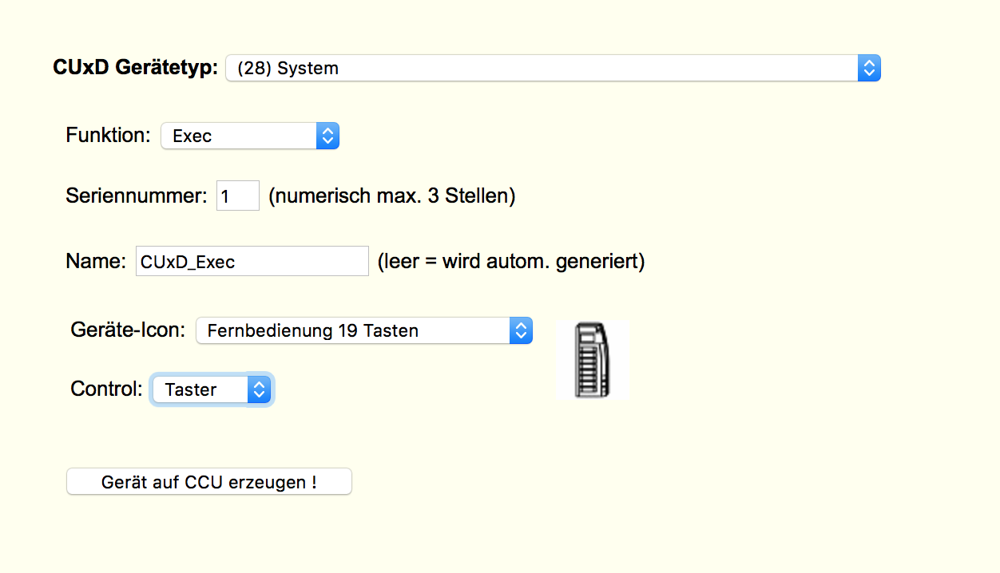
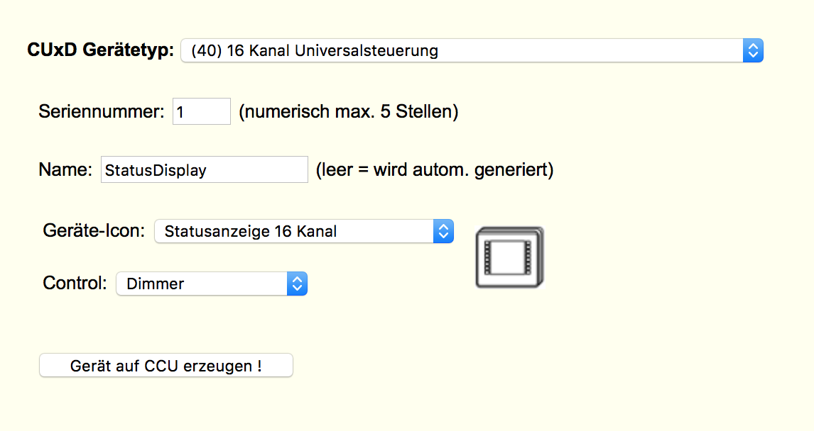
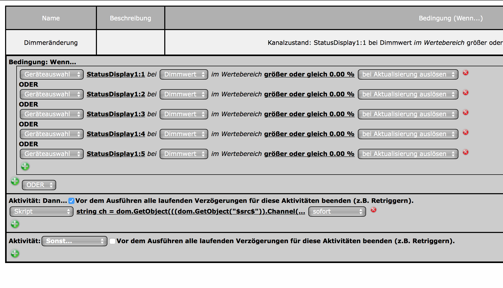
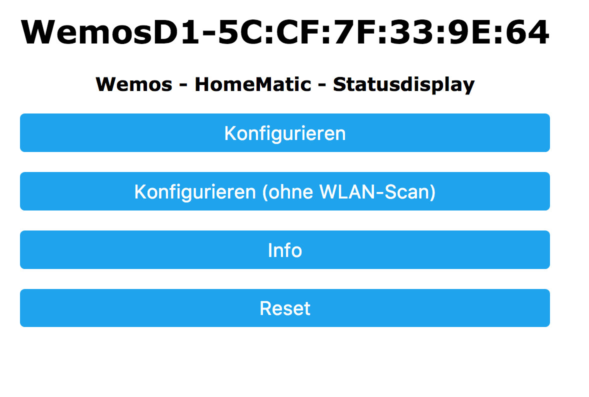

# WemosD1 HomeMatic Status Display

## Zusammenfassung:
Ziel dieses Projektes ist der kostengünstige Bau einer Statusanzeige, ähnlich der von HomeMatic angebotenen.

Die Helligkeit der LEDs lässt sich mit einem Taster in 25 Stufen einstellen.

**Hinweis: Das WebUI-Programm, das die Farbwerte der einzelnen LEDs setzt, läuft unter Firmwareversion 2.29.22 nur auf der CCU2 oder unter YAHM. Bei RaspberryMatic liegt derzeit noch ein [Bug](https://github.com/jens-maus/RaspberryMatic/issues/151) in der Logikschicht vor, der das Ausführen verhindert!**

**2 Bilder des ersten Prototypen:**<br>
 

## Teileliste:
- 1x [Wemos D1 mini](http://www.ebay.de/itm/272271662681) (ca. 3,29 EUR)
- 1x [Taster](http://www.ebay.de/itm/263057910534)
- 16x RGB LED [WS2812B](http://www.ebay.de/itm/222580456169) (ca. 5,95 EUR für 50 Stück!)
- _optional: 1x HC-SR501 PIR Bewegungsmelder_

**Aufbau:**<br>


**Frontplatte:**
Eine Vorlage für den 3D-Druck der Frontplatte könnt ihr hier herunterladen: [Front.stl](Images/Front.stl)

## Einrichtung der CCU
### Erstellen eines neuen CUxD Exec (sofern nicht bereits vorhanden!)<br>


### Erstellen eines neuen CUxD Dimmers<br>


### Erstellen eines Programms<br>


Das Skript im DANN-Block (die IP-Adresse ist entsprechend anzupassen!):
```
string displayIP = "192.168.1.99";
string channel = dom.GetObject(((dom.GetObject("$src$")).Channel())).Name();
real r = dom.GetObject("$src$").Value();
r = r + 0.0000001;

integer val = ( r * 10).ToInteger();
integer ledNum = channel.StrValueByIndex(":", 1).ToInteger();

dom.GetObject("CUxD.CUX2801001:1.CMD_EXEC").State ("/usr/local/addons/cuxd/curl -s -k -d led="#ledNum#" -d dim="#val#" http://"#displayIP#"/set");
```
### Flashen der Firmware
Nach dem Zusammenbau der Komponenten kann die Firmware `WemosD1_HomeMatic_StatusDisplay.ino.d1_mini.bin` ([Download](https://github.com/jp112sdl/WemosD1_HomeMatic_StatusDisplay/releases/latest)) auf den Wemos geflasht werden. 
#### Vorgehensweise:
1. Voraussetzungen:
    - CH340-Treiber installieren ([Download-Seite des Herstellers](https://wiki.wemos.cc/downloads))
    - Kommandozeilentool [esptool](https://github.com/igrr/esptool-ck/releases) herunterladen (Windows, Linux Mac) 
    - oder grafisches Tool [ESP8266Flasher](https://esp8266.ru/download/esp8266-utils/esp8266_flasher.zip) herunterladen und entpacken (Windows)
2. Die Dateien `esptool.exe` und `WemosD1_HomeMatic_StatusDisplay.ino.d1_mini.bin` am besten in einem gemeinsamen Verzeichnis ablegen
3. Wemos mit einem USB-Kabel an den PC anschließen
4. Bezeichnung des neuen COM-Ports im Gerätemanager notieren (z.B. COM5)
- Flash-Vorgang durchführen (mit grafischem ESP8266Flasher):
    - esp8266_flasher.exe mit Doppelklick starten
    - auf den Button "Bin" klicken und heruntergeladene `WemosD1_HomeMatic_StatusDisplay.ino.d1_mini.bin` auswählen
    - `COM1` auf den unter 4. ermittelten COM-Port ändern
    - Wemos vom USB trennen
    - D3 und GND miteinander verbinden, dabei den Wemos wieder an USB anschließen _(der Wemos befindet sich nun im Bootloader-Modus)_
    - Download anklicken
- Flash-Vorgang durchführen (mit esptool auf Kommandozeile): 
    - (Windows) Eingabeaufforderung öffnen
    - ins Verzeichnis wechseln, in das `esptool` und `WemosD1_HomeMatic_StatusDisplay.ino.d1_mini.bin` (cd c:\... usw.) abgelegt wurden
    - anschließend Flash-Vorgang starten mit dem Befehl

`esptool.exe -vv -cd nodemcu -cb 921600 -cp COM5 -ca 0x00000 -cf WemosD1_HomeMatic_StatusDisplay.ino.d1_mini.bin`


## Konfiguration des Wemos
Um den Konfigurationsmodus zu starten, muss der Wemos mit gedrückt gehaltenem Taster (gestartet werden. Die blaue LED blinkt kurz und leuchtet dann dauerhaft.

Der Konfigurationsmodus ist nun aktiv.

Auf dem Handy oder Notebook sucht man nun nach neuen WLAN Netzen in der Umgebung.

Es erscheint ein neues WLAN mit dem Namen "WemosD1-xx:xx:xx:xx:xx:xx"

Nachdem man sich mit diesem verbunden hat, öffnet sich automatisch das Konfigurationsportal.

Geschieht dies nicht nach ein paar Sekunden, ist im Browser die Seite http://192.168.4.1 aufzurufen.

Es erscheint:<br>



"Konfigurieren" wählen. Es erscheint:<br>


_(evtl. lade ich mal 2 gleichgroße Bilder hoch) ;)_

**Erklärung der Angaben:**
- SSID / WLAN-Key = Zugangsdaten zum heimischen WLAN
  - wenn eine statische IP festgelegt werden soll, kann man diese am unteren Ende der Konfigurationsseite eingeben
- IP der CCU2: IP der CCU2 :) 
- Gerätename: Name des CUxD Dimmers. Im Beispiel oben: "StatusDisplay"
- Boot: Lade Werte von CCU: wenn aktiviert, werden beim Hochfahren des Statusdisplays die letzten LED-Zustände von der CCU abgerufen
- Anzahl LEDs: Im "Normalfall" **16** - wer weniger oder mehr LEDs benutzen möchte, kann dies hier festlegen
- RGB Reihenfolge: Wenn die gewünschte Farbe nicht der tatsächlichen, von der LED wiedergegebenen Farbe entspricht, ist der Wert zu ändern. Die meisten WS2812B LEDs verwenden jedoch "GRB". 
- Farbe für Dimmer ...: hier legt man fest, welcher CUxD Dimmerwert (in 10er Schritten) mit welcher LED Farbe angezeigt werden soll. Die Farben sind in HEX-Werten ohne führende "#" anzugeben. Um die Farben zu "finden" gibt es online [Farbpaletten](http://htmlcolorcodes.com)


Wer "Danke" sagen möchte (in Form einer kleinen Spende), kann gern hier klicken: [](https://www.paypal.com/cgi-bin/webscr?cmd=_s-xclick&hosted_button_id=UBX8NFNYVWW8N)
