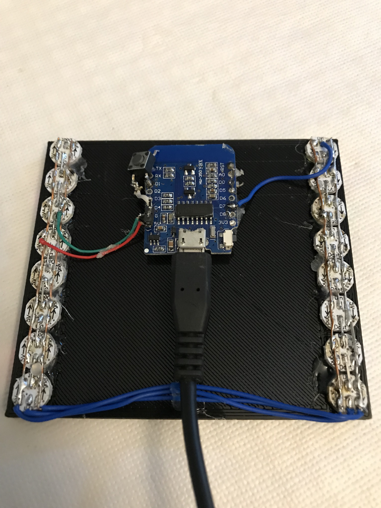

# WemosD1 HomeMatic Status Display

## Zusammenfassung:
Ziel dieses Projektes ist der kostengünstige Bau einer Statusanzeige, ähnlich der von HomeMatic angebotenen.

Die Helligkeit der LEDs lässt sich mit einem Taster in 25 Stufen einstellen.

**2 Bilder des ersten Prototypen:** 
 

Die komplette Nachbauanleitung findet ihr im [Wiki](https://github.com/jp112sdl/WemosD1_HomeMatic_StatusDisplay/wiki)
